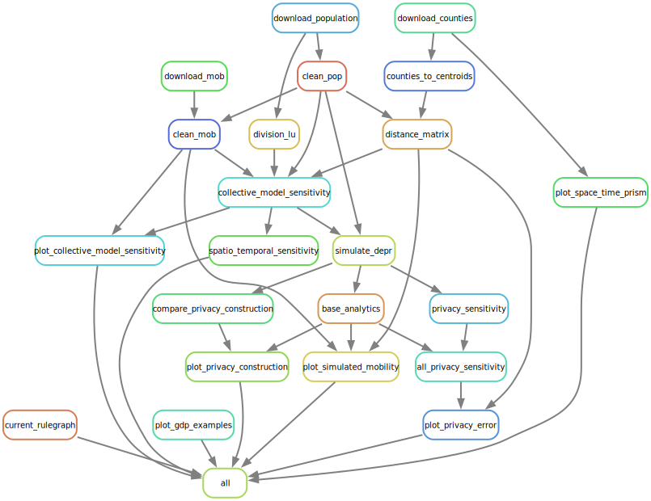

# federated_analytics_paper

Code supporting the publication __. 

# Workflow diagram



# Installation

This repository uses conda for portability of R and Python code supporting the analysis. 

To create a conda environemtn with the required dependencies, run:

```{shell}
bash setup.sh
```

# Data

* Empirical mobility data is from the [COVID19USFlows](https://github.com/GeoDS/COVID19USFlows-DailyFlows) dataset.
* Spatial boundaries are from the US Census __. 
* Population estimates are from the US Census __ . 

