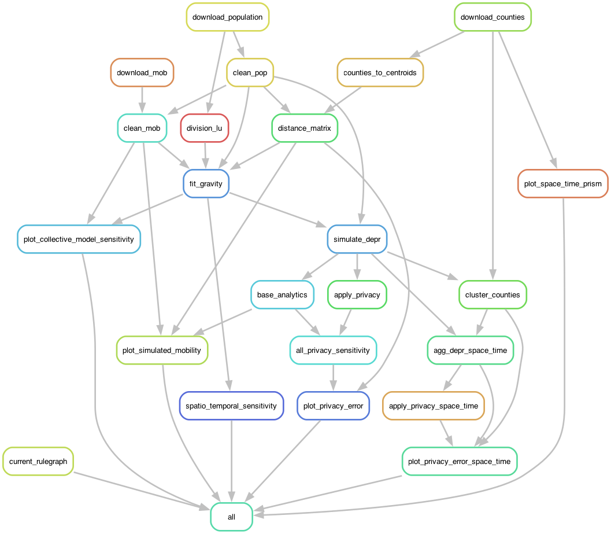

# federated_analytics_paper

Code supporting the publication *Impact of federated data with local differential privacy for human mobility modeling* by Gibbs, et. al. 

# Workflow diagram



# Installation

This repository uses conda for portability of R and Python code supporting the analysis. 

To create a conda environment with the required dependencies, run:

```{shell}

bash setup.sh
```

# Data

* Empirical mobility data is from the [COVID19USFlows](https://github.com/GeoDS/COVID19USFlows-DailyFlows) dataset.
* Spatial boundaries are from the US Census [U.S., Current County and Equivalent National Shapefile](https://catalog.data.gov/dataset/tiger-line-shapefile-2019-nation-u-s-current-county-and-equivalent-national-shapefile). 
* Population estimates are from the US Census [County Population Totals: 2010-2019](https://www.census.gov/data/datasets/time-series/demo/popest/2010s-counties-total.html). 

# Cluster execution

Snakemake can execute in a computing cluster. This analysis used UCL's [Myriad](https://www.rc.ucl.ac.uk/docs/Clusters/Myriad/) cluster.

To execute in a similar cluster, setup the conda environment specified in `setup.sh`.

Install the Snakemake cluster executor plugin: 

```
pip install snakemake-executor-plugin-cluster-generic
```

Execute the analysis with:

```
snakemake --executor cluster-generic --cluster-generic-submit-cmd 'qsub' --envvars LD_LIBRARY_PATH
```

